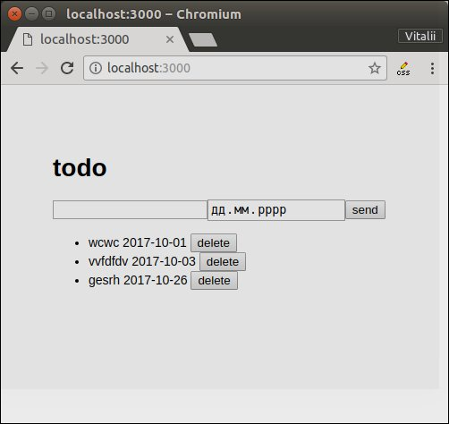
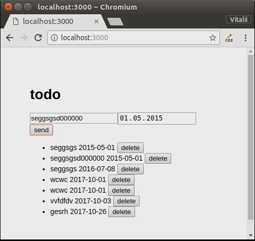
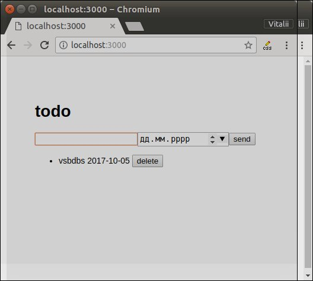

# kpp-lab2
  ### Мета
Ознайомитися з технологіями node.js,express.js, mongodb, написанням серверних аплікацій
  ### Опис програми
Програма використовується для створення завдань. Завдання можна створити і видалити, також справа біля завдання вказується дата кінцевого терміну виконання.
Завдання з'являються на екрані у відсортованому вигляді(від найближчої дати).

  

### Висновок
Було розглянуто javascript оточення, та документно-орієнтовану субд mongodb, набуто початкових навичок програмування серверних аплікацій. 
